# 树与二叉树

## 基本概念

树是一种非线性结构，其严格的数学定义是：如果一组数据中除了第一个节点（第一个节点称为根节点，没有直接前驱节点）之外，其余任意节点有且仅有一个直接前驱，有零个或多个直接后继，这样的一组数据形成一棵树。这种特性简称为一对多的逻辑关系。

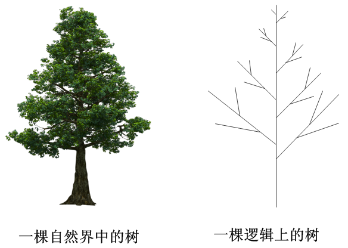

---

## **常见例子**

日常生活中，很多数据的组织形式本质上是一棵树。比如一个公司中的职员层级关系，一个学校中的院系层级关系，淘汰赛中的各次比赛队伍，一个家族中的族谱成员关系等，这些都是树状逻辑结构。由于树状结构表现出来都是具有层次的，因此也被称为层次结构。

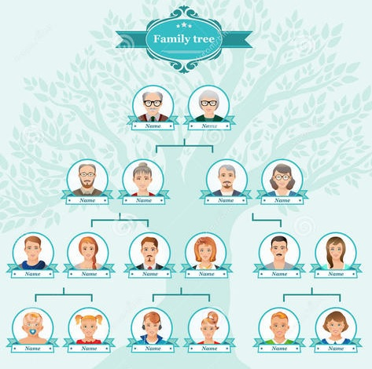

通常，在逻辑上表达一棵抽象的树状结构的时候，习惯于将树根放在顶部，树枝树杈向下生长，如下图所示。

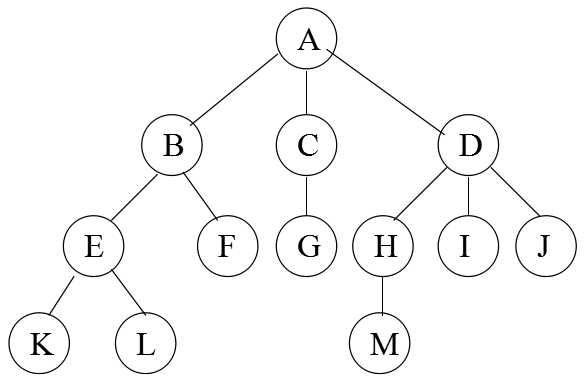

对于一棵树来说，有如下基本术语：

1. **根（root）：**
   树的第一个节点，没有直接前驱。如上图中的A。
2. **双亲节点（parent）：**
   某节点的直接前驱称为该节点的双亲节点，或成为父节点。例如上图中A是B的父节点。
3. **孩子节点（child）：**
   某节点的直接后继称为该节点的孩子节点。例如上图中B、C、D均为A的孩子节点。
4. **节点的层次（level）：**
   根节点所在的层次规定为第1层，其孩子所在的层次为第2层，后代节点以此类推。比如上图中节点E的层次是3。
5. **节点的度（degree）：**
   一个节点拥有的孩子节点的总数，称为该节点的度。比如上图中节点B的度为2。
6. **叶子（leaf）：**
   一棵树中度等于0的节点，被称为叶子，又称为终端节点。比如上图中K、L、F、G、M、I、J均为叶子。
7. **树的高度（height）：**
   一棵树中所有节点的层次的最大值，称为这棵树的高度，又称为树的深度。比如上图的树的高度为4。
8. **有序树与无序树：**
   一棵树中，如果某个节点的孩子节点之间是有次序的，则称这棵树为有序树，反之称为无序树。

---

## **二叉树**

在各种不同的树状结构中，最常见也最重要的是二叉树（Binary Tree），下面是二叉树的定义：

- 有序树
- 任意节点的度小于等于2

比如如下这棵树就是一棵二叉树。其中8是根节点，14是10的右孩子（因为二叉树是有序树，因此严格区分左右），而13则是14的左孩子。


为了方便对二叉树进行操作，通常会对一棵它进行标号：从上到下，从左到右进行标号：

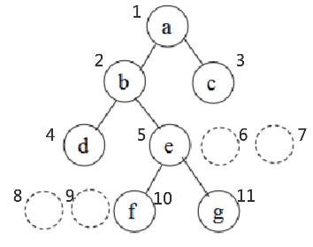

> 注意：
> 没有孩子节点的地方也要标出来

对于二叉树而言，有如下特性：

1. 第 `i` 层上，最多有 `2^(i-1)` 个节点。
2. 高度为 `k` 的二叉树，最多有 `2^k - 1` 个节点。
3. 假设叶子数目为 `n0` ，度为 2 的节点数目为 `n2`，则有：`n0` = `n2` + 1

另外，还需掌握如下重要的基本概念：

- **满二叉树/完美二叉树**：（full/perfect binary tree）
  树的高度为 `k` ，且树的节点总数达到 `2^k - 1`  的二叉树。
- **完全二叉树**：（complete binary tree）
  各节点的标号连续。
- **平衡二叉树**：（balance binary tree）
  任意节点的两棵子树高度差小于等于1。
- **退化二叉树**：（degenerate binary tree）
  所有的节点的度小于等于1，此时的二叉树实际上已经退化成链表。

---

## **存储形式**

与其他逻辑结构类似，可以使用顺序存储，也可以使用链式存储。

- 顺序存储

由于在顺序存储，数据元素之间的逻辑关系是用物理位置来表达的，而二叉树中每一个节点都有一个对应的标号，因此可以使用标号来作为数组的下标，但除非是完美或者完全二叉树，否则会浪费存储空间，如下图所所示。

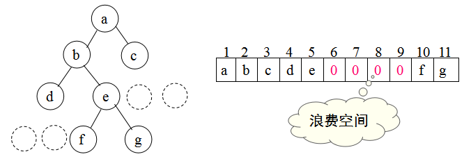

在顺序存储中，节点彼此之间的关系，要用到二叉树标号的基本特性。简单观察二叉树的标号会发现如下规律：

1. 根节点标号为1，根节点没有父节点
2. 标号为 n 的节点，其父节点的标号为 n/2
3. 标号为 n 的节点，其左孩子（若有）的标号为 2n，其右孩子（若有）的标号为 2n + 1

根据以上结论，在顺序存储的二叉树中，虽然没有任何信息连接节点e和f，但根据他们的下标序号，可以得知e是f的父节点，且f是e的左孩子。

- 链式存储

链式存储思路与链表类似，使用指针来直接将节点的逻辑关系串起来，比如：

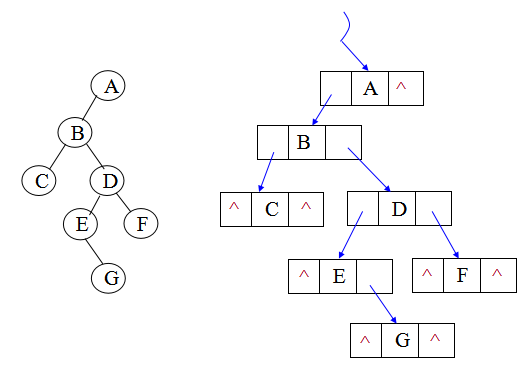

对于链式存储而言，二叉树节点的设计与链表无异，如下：

```
typedef struct node
{
    datatype data; // 用户数据

    struct node *lchild; // 左子树指针
    struct node *rchild; // 右子树指针
}node;
```

---

## **树的遍历**

所谓遍历，就是按某种规律访问每一个节点。对于之前的线性表而言，遍历算法很简单，就是从头跑到尾，因为线性表是一对一的关系。但是树状结构是非线性的，因此从根节点开始遍历所有节点可以有多种不同的算法，常见的有：

- 前序遍历：**根节点** - 左子树 - 右子树
- 中序遍历：左子树 - **根节点** - 右子树
- 后序遍历：左子树 - 右子树 - **根节点**
- 按层遍历：从上到下，从左到右依次访问节点

其中需要注意的是，前中后序遍历，都是递归算法。以前序遍历为例，当访问完根节点，进而要访问左子树时，由于左子树本身一棵二叉树，因此也需要进行前序遍历，也是先访问左子树的根节点，然后再依次访问左子树的左子树和左子树的右子树。比如：

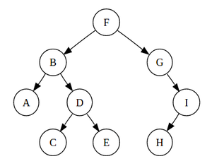

前序遍历的序列是：**F** - [BADCE] - [GIH]
其中，F是根节点，而BADCE是左子树，GIH是右子树。
对左子树的访问，也符合前序遍历的定义，即：**B** - [A] - [DCE]

以此类推，对上述二叉树而言：
中序遍历的序列是：[ABCDE] - **F** - [GHI]
后序遍历的序列是：[ACEDB] - [HIG] - **F**

至于按层遍历，就按照字面意思理解即可，序列是：FBGADICEH

---

---

# BST原理与应用

## **BST的基本概念**

二叉树的其中一个重要应用，是提供一种快速查找数据的方法，即：将数据节点按照某种规律形成一棵二叉树，然后利用二叉树特殊的逻辑结构减少搜索数据的次数，提高查找的效率。

这种按照某种规律构建，用来提高搜索性能的二叉树，被称为搜索二叉树（Binary Search Tree），即BST。

具体而言，二叉树提高搜索效率的秘诀在于：按照“小-中-大”（当然“大-中-小”也是一样的）的规律来存储数据，即对于任意一个节点，都可以明确找到其值大于或等于其左孩子节点，且小于或等于其右孩子节点。如下图所示：

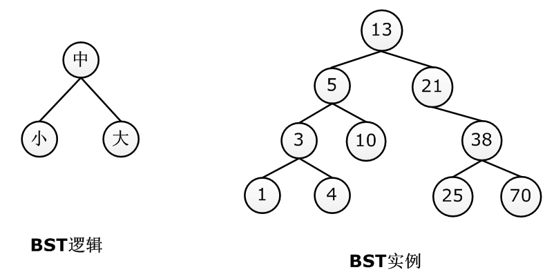

由于树中所有的节点均满足“小-中-大”的规律，因此当从根开始查找某个节点时速度比顺序查找要快得多，比如要找节点38，当发现38大于根节点13后，就可以确定13的左子树一定没有38，这就去掉了半边子树的节点。

因此，二叉搜索树又被称为二叉排序树、二叉查找树。

实际上，对于一棵二叉树而言，其搜索节点的时间复杂度，最糟糕的情形是其退化为链表，最乐观的情形是完美或完全二叉树，那么其搜索时间复杂度就是介于：

$$
最差：T(n)=O(n)
$$

$$
最优：T(n) = O(log_2n)
$$

---

## **插入节点**

对于BST而言，插入一个节点主要是要保持其“小-中-大”的逻辑不变，因此插入的节点的逻辑可以从根节点开始，一步步寻找新节点的“最终归宿”，比如在如下BST中，要插入新节点16，最终应该插入到节点17的左孩子处。

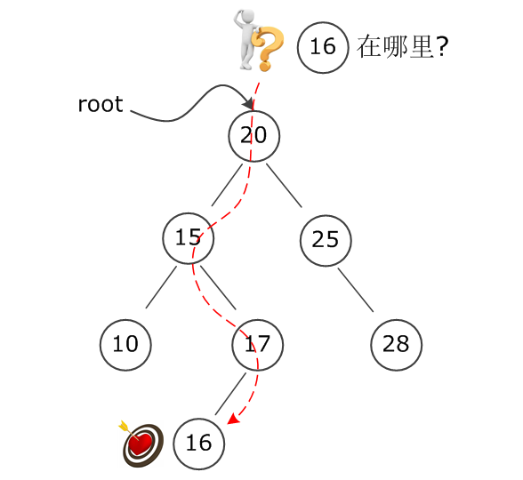

在实现插入算法的时候，由于树状结构本身是递归的，因此可以使用递归函数更优雅地实现插入算法。如下：

```c
/// @brief 按BST规定插入新节点
/// @param root 指向树的根节点的指针
/// @param new 指向需要插入的新根节点的指针
/// @return 成功，返回指向根节点的指针。失败，返回 NULL。
/// @note BST(Binary Search Tree)搜索二叉树。BST规定：在任何子树中，根节点必须大于其左子树中任意的节点，且必须小于其右子树中任意的节点，换句话说必须满足“小(右)--中(根)--大(左)”的逻辑次序。
TreeLink bst_insert(TreeLink root, TreeLink new)
{
    if (root == (TreeLink)NULL)
    {
        return new;
    }

    if (new == (TreeLink)NULL)
    {
        return root;
    }

    if (new->data >= root->data)
    {
        root->right = bst_insert(root->right, new);
    }
    else
    {
        root->left = bst_insert(root->left, new);
    }
    return root;
}
```

---

## **删除节点**

删除一个BST的节点要比插入困难一点，但同样是要遵循一个原则，即：删除节点后仍然要保持“小-中-大”的逻辑关系。
假设要删除的节点是x，大体思路如下：

1. 若要删除的节点小于根节点，则递归地在左子树中删除x
2. 若要删除的节点大于根节点，则递归地在右子树中删除x
3. 若要删除的节点恰好就是根节点，则分如下几种情况：
   a. 根节点若有左子树，则用左子树中最大的节点max替换根节点，并在左子树中递归删除max
   b. 否则，若有右子树，则用右子树中最小的节点min替换根节点，并在右子树中递归删除min
   c. 否则，直接删除根节点

以下图为例，假设在一棵二叉树中要删除节点15，在找到节点之后，判断其有左子树，那么就沿着其左子树找到最右下角（最大）的节点19，替换要删除的节点15，然后再将多余的节点19删掉：

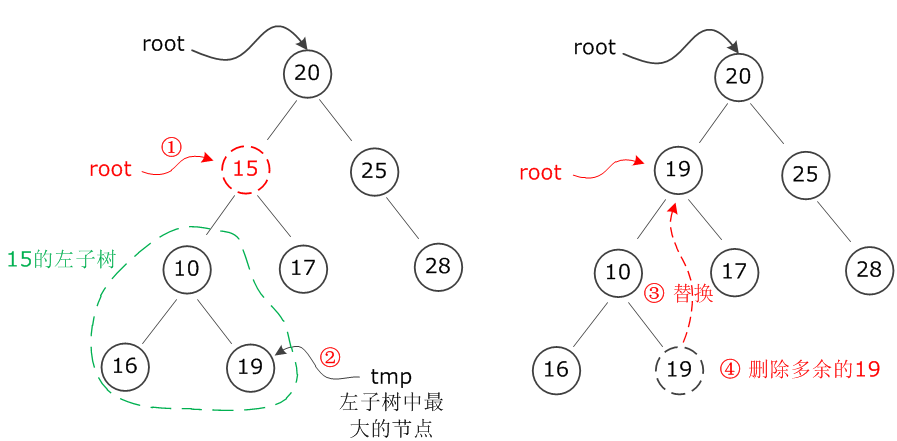
									删除一个有左子树的节点过程

而如果要删除的节点没有左子树，只有右子树，那么情况是完全对称的，如下图所示，假设要删除节点25，由于25没有左子树，因此找到其右子树中最左下角（最小）的节点16，替换要删除的节点25，然后再将多余的节点16删掉：

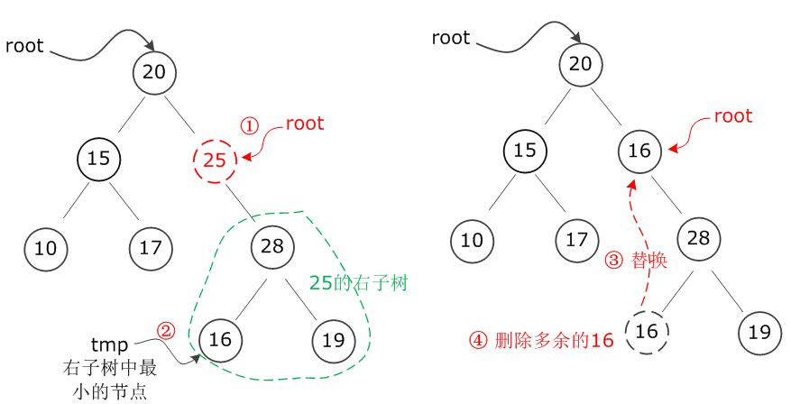
									删除一个只有右子树的节点过程

```c
/// @brief 删除二叉搜索树中的节点data
/// @param root 指向树的根节点的指针
/// @param data 需要查删除的节点中的数据
/// @return 成功，返回指向树的根节点的指针。失败，返回 NULL。
/// @note 二叉搜索树在删除节点后，仍要满足二叉搜索树“小(右)--中(根)--大(左)”的逻辑次序。
TreeLink bst_remove(TreeLink root, int data)
{
    if (root == (TreeLink)NULL)
    {
        return (TreeLink)NULL;
    }
    else if (root->data > data) // 需要删除的数据比根节点的数据小，则进入左子树中查找
    {
        root->left = bst_remove(root->left, data);
    }
    else if (root->data < data) // 需要删除的数据比根节点的数据大，则进入右子树中查找
    {
        root->right = bst_remove(root->right, data);
    }
    else if (root->data == data) // 需要删除的数据等于根节点的数据
    {
        if (root->left == NULL && root->right == NULL) // 需要删除的数据在叶子节点中，直接删除
        {
            free(root);
            return (TreeLink)NULL;
        }
        else if (root->left != NULL) // 有左子树，寻找左子树中的最大值节点，用其替换根节点并删除该节点。
        {
            TreeLink max = root->left;
            while (max->right != NULL)
            {
                max = max->right;
            }
            root->data = max->data;
            root->left = bst_remove(root->left, max->data);
        }
        else if (root->right != NULL) // 有右子树，寻找右子树中的最小值节点，用其替换根节点并删除该节点。
        {
            TreeLink min = root->right;
            while (min->left != NULL)
            {
                min = min->left;
            }
            root->data = min->data;
            root->right = bst_remove(root->right, min->data);
        }
    }

    return root;
}
```

---

## **遍历代码**

以上述练习中的二叉树为例，采用前、中、后序遍历的算法示例代码如下：

```c
/// @brief 前序遍历
/// @param root 指向树的根节点的指针
/// @note 前序遍历：即先访问根节点，再访问左子树，最后访问右子树。
void pre_travel(TreeLink root)
{
    if (root != (TreeLink)NULL)
    {
        printf("%d ", root->data);
        pre_travel(root->left);
        pre_travel(root->right);
    }
}

/// @brief 中序遍历
/// @param root 指向树的根节点的指针
/// @note 中序遍历：即先访问左子树，再访问根节点，最后访问右子树。用中序遍历，遍历里BST树，可以把BST中的元素，按从小到大的顺序输出。
void mid_travel(TreeLink root)
{
    if (root != (TreeLink)NULL)
    {
        mid_travel(root->left);
        printf("%d ", root->data);
        mid_travel(root->right);
    }
}

/// @brief 反转中序遍历
/// @param root 指向树的根节点的指针
/// @note 反转中序遍历：即先访问右子树，再访问根节点，最后访问左子树。用反转中序遍历，遍历里BST树，可以把BST中的元素，按从大到小的顺序输出。
void mid_travel_reversal(TreeLink root)
{
    if (root != (TreeLink)NULL)
    {
        mid_travel(root->left);
        printf("%d ", root->data);
        mid_travel(root->right);
    }
}

/// @brief 后续遍历
/// @param root 指向树的根节点的指针
/// @note 后续遍历：即先访问左子树，再访问右子树，最后访问根节点。
void post_travel(TreeLink root)
{
    if (root != (TreeLink)NULL)
    {
        post_travel(root->left);
        post_travel(root->right);
        printf("%d ", root->data);
    }
}
```

对于按层遍历，则需要借助队列来达到这一目的。具体做法是：

1. 创建一个队列，并将根节点指针入队
2. 判断队列是否为空：
   a. 是则退出程序
   b. 否则让队头元素出队，并将队头的左右孩子依次入队
   c. 循环步骤2

以下是示例代码：

```c
/// @brief 按层遍历
/// @param root 指向树的根节点的指针
void level_travel(TreeLink root)
{
    if (root == NULL)
        return;

    // 将根节点入队
    linkQueue *q = initQueue();
    enQueue(q, root);

    TreeLink tmp;
    while (!isEmpty(q))
    {
        // 出队并访问队头
        outQueue(q, &tmp);
        printf("%d ", tmp->data);

        // 依次将其左右孩子（若有）入队
        if (tmp->left != NULL)
            enQueue(q, tmp->left);

        if (tmp->right != NULL)
            enQueue(q, tmp->right);
    }
    printf("\n");
}
```

队列相关操作详见 `queue_list.h`。

